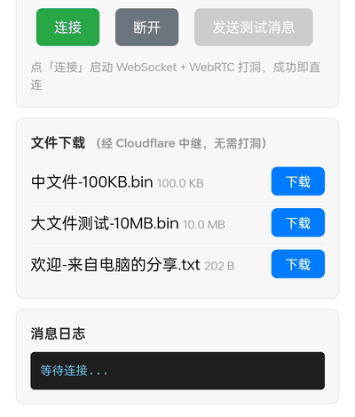

# 🌐 PhotoTrans-P2P

> **手机在外面也能下载家里电脑的文件** —— 免费 · 不装 App · 浏览器直接用

<p align="center">
  
  
  
  
  
  
</p>

> ⚠️ **本版本为测试版（Preview / Beta）**：未经过更深层的验证，可能存在未知问题（网络兼容、稳定性、安全等）。请先在小范围评估后使用；使用中遇到任何问题请及时反馈，我们会持续修复。

---

## 📖 目录

- [🎬 演示](#-演示)
- [🚀 三步上手](#-三步上手)
- [⚙️ 配置文件](#️-配置文件)
- [🏠 两种模式](#-两种模式)
- [⚠️ 使用须知（重点，先读）](#️-使用须知重点先读)
- [☁️ 建议：上服务器](#️-建议上服务器让快和稳定都成立)
- [📊 实测数据](#-实测数据)
- [🔧 架构](#-架构)
- [🛠️ 技术栈](#️-技术栈)
- [📄 许可](#-许可)

---

## 🎬 演示

<p align="center">
  
</p>

手机浏览器打开网址（无需登录）→ 点「下载」→ 实时进度 → 浏览器保存确认 → 完成。上图是**真机实录**：OPPO 手机经 Cloudflare 免费隧道下载 10MB 测试文件。

---

## 🚀 三步上手

**1. 改配置**

编辑 `config.json`，把 `share_dir` 改成你想共享的文件夹（模板见 `config.example.json`）：

```json
{
  "share_dir": "D:\\我的共享文件夹",
  "port": 8082
}
```

**2. 启动**

| 场景 | 双击哪个 | 说明 |
|---|---|---|
| 家里（同一 WiFi） | `start.bat` | 全速，不经过外网 |
| 在外面（4G/5G） | `start_public.bat` | 自动起 Cloudflare 隧道 |

**3. 手机打开网址**

- 局域网模式：看窗口打印的 `局域网` 地址（手机连同一 WiFi）
- 公网模式：窗口会打印 `https://xxx.trycloudflare.com`，手机直接打开就能选文件下载

> 💡 命令行窗口**不要关**，关了服务就停。

## ⚙️ 配置文件

`config.json` 是唯一的配置入口，两个字段：

| 字段 | 说明 | 默认 |
|---|---|---|
| `share_dir` | 共享目录（不存在会自动创建 `share/`） | `./share` |
| `port` | 服务端口，一般不用改 | `8082` |

## 🏠 两种模式

| 模式 | 启动脚本 | 适用 | 实测速度 |
|---|---|---|---|
| 🏠 局域网 | `start.bat` | 手机和电脑连同一 WiFi | **41 MB/s**（全速） |
| ☁️ 公网 | `start_public.bat` | 手机在外面（4G/5G/移动网） | **1 ~ 1.5 MB/s** |

建议：**家里优先用局域网地址**（全速、不耗流量）；在外面才用公网网址。

---

## ⚠️ 使用须知（重点，先读）

### 1️⃣ 速度上限的真相：瓶颈是你家宽带的"上行"

实测同一条 10MB 文件：**局域网直连 41 MB/s，公网只有 1~1.5 MB/s**。
这不是 Cloudflare 隧道限速（[Cloudflare Tunnel 免费版本身不限速](https://cloud.tencent.com.cn/developer/article/2710363)），而是——**手机从外面下载时，数据要从你家电脑"上传"出去，你家宽带的上行带宽就这么多**（常见家用宽带上行只有 8~30Mbps）。

**任何方案**（WebRTC / frp / 自建中继 / 换隧道商）只要数据还在你家电脑、走这根光纤，**上限都一样**。想让外网下载更快，只有两条路：

- ✅ 提高家庭宽带的上行带宽（换套餐 / 加一条高上行线路）
- ✅ 把服务搬到有高速上行的服务器上（见 **[☁️ 建议：上服务器](#️-建议上服务器让快和稳定都成立)**）

### 2️⃣ 网址（URL）会变，运行期内固定

- **运行期间 URL 固定**：`start_public.bat` 用 `--retries 100` 让隧道掉线自动重连、进程不退出，**窗口开着 URL 就不变**
- **重启后会变**：免费 quick tunnel 每次启动都是新 URL（无账号的 Cloudflare 特性）
- **想永久固定 URL**：注册 Cloudflare 免费账号 + 自有域名 + named tunnel（免费可行，需自行配置）

### 3️⃣ 掉线自动恢复

- 隧道断了：`--retries 100` 自动重连，URL 不变
- 本地服务死了：脚本每轮检查 8082 端口，没了自动重启
- 建隧道失败（偶发网络抖动）：脚本自动重试直到成功（已实测：超时后自动重试成功）

### 4️⃣ 手机浏览器兼容

- **文件下载不受影响**：走普通 HTTPS，任何浏览器都能下
- **WebRTC（P2P 加速）是可选增强**：不支持 WebRTC 的浏览器（如 VIA/部分 WebView）会自动跳过，**下载照常走中继**
- 跨运营商打洞（移动↔电信/联通）会被运营商丢 UDP 包，P2P 连不上——**正常现象，不是故障**

### 5️⃣ 安全提醒（重要）

- 共享目录**没有密码**：任何人拿到网址就能下载里面的文件，网址可能被转发
- **只把"愿意公开"的文件放进共享目录**，不要共享整个硬盘/私密文件夹
- 局域网模式同样无鉴权，但只在本机 WiFi 内可达，风险小一些
- 后续版本规划：访问口令 / 一次性链接 / 目录白名单

### 6️⃣ 免费隧道本身的性质

- 无账号 quick tunnel **没有 SLA/稳定性保证**（Cloudflare 官方说明），偶发波动/重连属正常
- 家庭电脑关机/睡眠 = 服务不可达，这是自托管方案的固有特性

---

## ☁️ 建议：上服务器（让"快"和"稳定"都成立）

家庭宽带的小上行是外网下载慢的**物理瓶颈**。如果这个工具打算认真用，最有效的升级是把服务放到一台 **有公网 IP + 高速带宽** 的服务器上：

| 维度 | 🏠 家里电脑 | ☁️ 云服务器（推荐） |
|---|---|---|
| 外网下载速度 | 1~1.5 MB/s（家宽上行瓶颈） | 通常 10~50 MB/s |
| URL 固定 | 每次重启变（除非自有域名） | 公网 IP 直连，或绑域名永远不变 |
| 可用性 | 关机/断电就没了 | 24 小时在线 |
| 成本 | 免费（已有设备） | 轻量 VPS 约 ￥30~60/月 |

**落地方式**：

1. **最简单**：代码放到 VPS，`python server.py` + `cloudflared`（或直接开 8082 绑域名），速度/URL/稳定性一次解决
2. **更省**：文件不多可以用 Cloudflare 免费静态托管（Pages/R2）——但那更像"网盘"，看你要不要长期托管
3. **保持文件在家**又提速：提高家庭宽带上行是唯一正解

> 💡 **一句话结论**：家里用（局域网）已经全速；外面用（公网）的 1MB/s 是家庭上行的天花板，不是代码能救的。要认真用 → 上服务器或提高上行，二选一。

---

## 📊 实测数据

| 场景 | 结果 | 日期 |
|---|---|---|
| 局域网直连下载 10MB | **41 MB/s** | 2026-09-25 |
| 手机(随身WiFi)经隧道下载 10MB | 1.02 MB/s | 2026-09-24 |
| 手机(5G)经隧道下载 10MB | 0.96 MB/s | 2026-09-24 |
| 手机经隧道下载 10MB（重测） | 1.55 ~ 2.65 MB/s | 2026-09-25 |
| WebRTC 同网段直连 | ICE connected，数据通道通 | 2026-09-24 |
| WebRTC 跨运营商打洞 | 失败（运营商丢 UDP 包） | 2026-09-24 |

## 🔧 架构

```
┌─────────────────┐        ┌──────────────────┐        ┌──────────────────┐
│  手机浏览器       │ ──────►│  Cloudflare      │ ──────►│  电脑 server.py   │
│  （零安装）       │  HTTPS │  Tunnel（免费）    │  TCP   │  （共享目录）      │
└─────────────────┘        └──────────────────┘        └──────────────────┘
        │                                                        │
        └───────────────── WebRTC 打洞（可选加速）────────────────┘
```

- **下载 / 信令**：浏览器 ↔ 电脑走 HTTPS（经 Cloudflare Tunnel 免费转发）
- **WebRTC**：同网络时直连加速；跨网 / 不支持时自动走中继，**不阻塞下载**

## 🛠️ 技术栈

| 组件 | 说明 |
|---|---|
| 后端 | Python 3 + aiohttp（HTTP/WebSocket）+ aiortc（WebRTC） |
| 前端 | 原生 HTML/JS（`static/index.html`），无需构建 |
| 穿透 | Cloudflare Tunnel（`cloudflared`，免费） |
| STUN | Cloudflare `stun:162.159.207.0:3478` |

> ⚠️ 不要用 Google STUN（`l.google.com`）：境内被污染，srflx 查询会静默失败，打洞必败。

### 依赖安装

```bash
pip install aiohttp aiortc
```

`cloudflared.exe` 需自行下载放本目录：https://github.com/cloudflare/cloudflared/releases/latest → `cloudflared-windows-amd64.exe` 改名。

---

## 📄 许可

[MIT License](LICENSE) © nmhwsygxb

## 与 PhotoTransDrive 的关系

| 项目 | 定位 |
|---|---|
| **PhotoTransDrive** | 电脑端网盘（局域网直连 + 分享链接引擎） |
| **PhotoTrans-P2P**（本仓库） | 浏览器端下载，手机零安装 |

两者互补：在家用局域网地址全速，在外面用 CF 隧道网址保底。